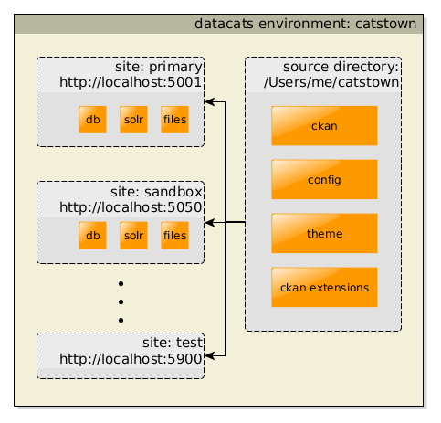

User Guide
==========

What is datacats
----------------

CKAN can be quite difficult to develop and deploy, especially for beginners.
The aim of datacats is to make this easier and bring CKAN within reach for a
much wider audience.

datacats relies on Docker_ to "containerize" the CKAN environment. If you don't
know much about Docker, it doesn't matter. You need to know very little about
it in order to use datacats. If you wish to know more about how
this project works, take a look at :doc:`docker`.

.. _Docker: https://www.docker.com/

Install datacats
------------
Getting datacats ready for work involves three parts:

- `Install Docker`_
- `Create a virtualenv environment`_
- `Install datacats command line tool`_
- `Download the necessary Docker containers`_

datacats currently supports **Linux** and **OSX** (Apple computers) operating systems out of the box.

Windows is not supported natively just yet even though we are working on it.
For now, you can run datacats on Windows using a Linux
Virtual Machine. Simply install VirtualBox or VMWare, create a Ubuntu VM (Virtual Machine), and install datacats on top of it.

.. _Install Docker:

Install Docker
""""""""""""""
You will need to install Docker first.
Detailed OS-specific reference on how to do that is available at the
`Installation Instructions section on Docker site`_ .

.. _Installation Instructions section on Docker site: https://docs.docker.com/installation/#installation

Here is the quick OS-specific summary that is sufficient in most cases:

.. _Create a virtualenv environment:

Create a virtualenv environment:
""""""""""""""""""""""""""""""""
We recommend you use datacats inside a virtualenv environment. To install 
`virtualenv`_ run the following in your shell: ::

    pip install virtualenv
    virtualenv myckan
    . myckan/bin/activate

.. _virtualenv: http://virtualenv.readthedocs.org/en/latest/index.html

Linux
#####
Unfortunately, to date, some
OS package installation tools (like apt-get on **Ubuntu**) still only offer obsolete
versions of Docker by default which datacats does not support.

The surest way to install the most recent version of Docker
is to use the official installation script from the Docker website.

Open your shell and run the command: ::

  wget -qO- https://get.docker.com/ | sh
This command uses ``wget`` tool to download the script from the website and then runs it
in a shell (``sh``).

Another potential ground for complications is that Docker needs
Linux kernel version 3.10 or higher.
Updating your Linux distribution to the more recent version should address that.
In Ubuntu, version Ubuntu Saucy 13.10 or higher is sufficient.

OSX
###
You will need `docker-machine`_, the standard way to get Docker running on your Mac.

.. _docker-machine: https://docs.docker.com/installation/mac/

.. _`Install datacats command line tool`:

Install datacats
"""""""""""""""""""""
The easiest way to install datacats is with ``pip``. Making sure your virtualenv
is activated, in your shell run the following: ::

    pip install datacats

If you do not have ``pip`` installed, you can install it first by running: ::

    easy_install pip

.. _`Download the necessary Docker containers`:

Download the necessary Docker containers
"""""""""""""""""""""

As a last setup step, we need to pull the Docker images needed to
create your environment. This only needs to happen **once**. Those images are
then re-used for all subsequent environments you create.

To pull the Docker images just run::

    datacats pull

That is it, you are all set!

Install from source
"""""""""""""""""""""
A more advanced option is to install datacats directly from the source code.

This option may be needed if are considering contributing to the datacats development
or would like to try the most recent (and potentially unstable) version.

To install datacats directly from the `source code repository on Github`_,
clone the source repo to your custom location and
install datacats as a Python package from there: ::

  git clone git@github.com:datacats/datacats.git
  python setup.py develop

You will still need to download the necessary Docker images as described above.

.. _source code repository on Github: https://github.com/datacats/datacats

Getting Started
---------------

Create a datacats environment. Open a shell and run: ::

    datacats create catstown

.. image:: overview.png

Once done, a datacats source directory is created for you called
``catstown``.
You will be prompted to create an admin password for your site. You can
use this password to log into your CKAN site. The address of your CKAN
site will be printed.
To open that address in a web browser at any time, you can run: ::

    datacats open catstown

.. note::

    All ``datacats`` commands work without having to specify the environment
    to run them on, as long as you are within a datacats source directory
    or any sub-directory. For the above command, we could as well have ran: ::

        cd catstown/
        datacats open

Let's see what is inside our new source directory. ``cd`` into the directory
and take a look at the file structure. You should see something like this: ::

    catstown/
    |-ckan/
    |-ckanext-catstowntheme/
    |-development.ini
    |-schema.xml

The ``ckan/`` directory is the `source code of the CKAN project`_. By default,
datacats will initialize each project with the lastest version of CKAN. You can
change the version you wish to run by going into that directory and checking
out a different branch or tag. Alternatively, if you know ahead of time which
version of CKAN you wish to run, you can pass a flag directly to the
``datacats create`` command.

The ``ckanext-catstowntheme`` directory is an auto-generated sample
`CKAN extension`_.
While you can use CKAN in it's default form, most organizations and governments
deploying CKAN customize it in some way. Many forms of customization, such as
`designing your own custom theme`_, do not require a deep knowledge of CKAN. The
``ckanext-catstowntheme`` extension gives you a very basic skeleton which you
can use to get started.

The ``development.ini`` file holds all the configuration options for CKAN.
All of these options are described here_. Open this file and find a
line that starts with ``ckan.plugins``. It will look something like this: ::

    ckan.plugins = datastore text_preview recline_preview catstown_theme

The ``catstown_theme`` is the extension endpoint for our kittyville extension,
defined in ``ckanext-catstowntheme/setup.py``. We can enable and disable our
extension by adding it or removing it from the plugins list above.

Extensions & Customization
---------------------------
To see how this works, let us install another extension into our environment.
A good one to use is pages_, which adds a simple CMS to CKAN so we can add
custom content pages to our site. First, clone the pages source code into your
source directory. In the ``catstown/`` source directory, run: ::

    git clone git@github.com:ckan/ckanext-pages.git

This will clone the source into the ckanext-pages/ directory, right next to
``ckan/`` and ``ckanext-catstowntheme/`` like so: ::

    kittyville/
    |-ckan/
    |-ckanext-catstowntheme/
    |-ckanext-pages/
    |-development.ini
    |-schema.xml

Next, install this extension into your environment by running: ::

    datacats install

The install command will iterate through your source directory and install
all your extensions. After this is complete, we need to open the ``development.ini``
file again and add the pages extension to our list of installed extensions: ::

    ckan.plugins = datastore text_preview recline_preview catstown_theme pages

Finally, reload CKAN for the config changes to take effect: ::

    datacats reload

And our extension is now live! Open up your CKAN site, log into it, and you should
see a button in the top toolbar that will let you create custom content pages.

Deploying
---------
To deploy your datacats site just rsync your source directory to the
target host, then in the target source directory run: ::

    datacats init --image-only

You can start your new site in production mode with: ::

    datacats start --production --address=<IP-address>

You will need to set up DNS and, emails, logs etc.
To understand a bit
more about how datacats works under-the-hood. See :doc:`docker`

Shell Access
------------
To run an interactive shell within your CKAN environment, run: ::

    datacats shell catstown

Where ``catstown`` is your datacats environment name. The shell will immediately
drop you inside your source directory, and it will activate the ``virtualenv``.
The shell is useful if you want to run admin ``paster`` tasks such as database
migrations, or you simply want to poke around your CKAN site.

Paster Commands
---------------
To quickly run CKAN ``paster`` commands, you can do the following: ::

    datacats paster sysadmin add joe

Take a look at the `CKAN paster page`_ for a list of available commands.

.. note::

    With datacats, you don't need to worry about activating your ``virtualenv``,
    and you do not need to pass the ``--config`` option to paster. You also
    do not need to specify the ``--plugin=ckan`` option.
    datacats handles this for you automatically.

If you have ``paster`` commands inside your CKAN extensions, you can ``cd`` into
the extension directory and run the command from there: ::

    cd ckanext-archiver/
    datacats paster archiver clean

Developing on CKAN using DataCats
---------------------------------
In this section, we will provide you with some tips on how to develop on CKAN
itself using datacats.

The first datacats feature that allows for easy development of CKAN is the ease
of setting up a fully installed and ready-to-go debuggable instance of the master
branch: ::

    datacats create --ckan=master ckandev
    cd ckandev/ckan
    git pull
    datacats reload

You will now be able to edit the ckandev/ckan directory and see your changes
instantly reflected in your CKAN instance (which you can open with the
datacats open command).

Another feature we provide to make development easier is an interactive shell
function for our reload and create commands (this assumes the previous
commands were run). The interactive option allows you to see the output
directly from CKAN in your shell: ::

    datacats reload --interactive ckandev

Multisite
---------
As of version 1.0.0, datacats has support for having multiple "sites" under a
single environment. This means that there can exist several discrete data
catalogues based on the same CKAN source. This is done using the -s switch,
which can be applied to all commands that make sense to operate on a single
site (currently all commands excluding ``migrate``, ``pull``, ``less``, and
``install``). By default, datacats will operate on a site named 'primary'.

For example, to initialize a site with the name 'sandbox' under a pre-existing
environment called 'catstown', you could run the following command: ::

    datacats init -s sandbox catstown

This would create all the necessary containers and folders for the site and
begin running it on an appropriate (non-conflicting) port.

Logs
----
To see the log output of your CKAN: ::

    datacats logs

.. _source code of the CKAN project: http://github.com/ckan/ckan
.. _CKAN extension: http://extensions.ckan.org/
.. _extension guide: http://docs.ckan.org/en/latest/extensions/
.. _designing your own custom theme: http://docs.ckan.org/en/latest/theming/index.html
.. _here: http://docs.ckan.org/en/latest/maintaining/configuration.html
.. _pages: http://github.com/ckan/ckanext-pages
.. _CKAN paster page: http://docs.ckan.org/en/latest/maintaining/paster.html
